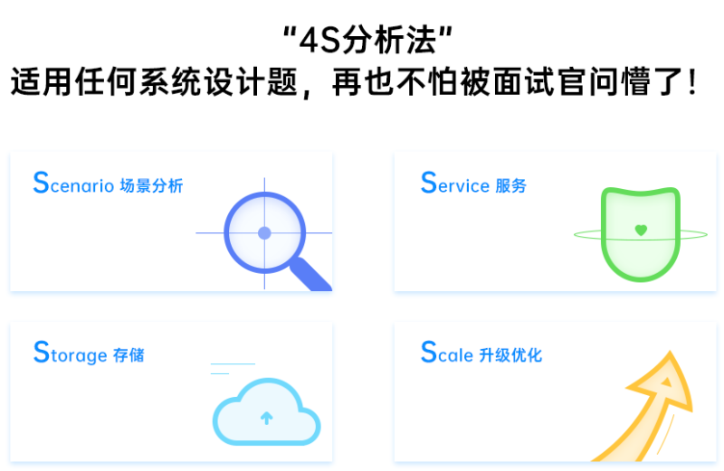
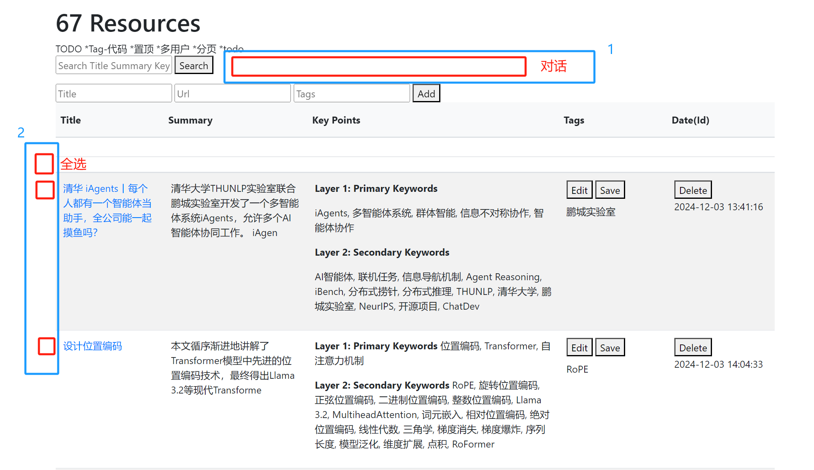

# 系统设计专题
关于笔记和认知 https://help.flomoapp.com/basic/xgbj.html
上下文检索 https://www.anthropic.com/news/contextual-retrieval
NoteBookLM
设计数据库 https://milvus.io/docs/zh/schema-hands-on.md#Schema-Design-Hands-On
RAG最佳实践 https://mp.weixin.qq.com/s/VYWoluo2BFXhWVRBjeP5IA
设计RAG工作流 https://docs.llamaindex.ai/en/stable/

## Project Background
背景：V1 1205
I like to read AI news and papers, but I need a system to help me collect them, let's design a system together

So, now we need to discuss my usage of this system. 
1. First, about the news source, it mostly comes from my positive read rather than crawling, that means I read a article first, if I think this is a good one, I want to save it some where, maybe 5 months later, I want to remember some key info in it or find some great ideas base on it(so the meta-data is important(and we will discuss meta-data strategy later)), and we will implement some function to collect news from websites/news apps/notebooks like Notion;
2. 1st point means that the system is not designed for a wide range randomly article crawling, but we can keep the crawl module, because we can use it to reach some related sources(this has some relation with point 3), but crawl is not the main way to get data, also, we don't need to design a crawl function by ourself, because I know some utility provided by some big company(e.g. JINA), we can use their tools and APIs;
3. We will think carefully about the data fusion strategy in our database, because we don't just collect articles and leave them their, I want the system to be alive and keep finding some interesting ideas. For example, I collected 2 articles on Monday, and 3 articles on Friday, are there any relation between them? e.g. they both mentioned a famous researcher, or they are in the similar topic/area, so we should first design the db columns to record these meta-data, to finding some interesting ideas, I would like to utilize the ability of LLM/VLM, so we need to design the database in a LLM friendly way.
e.g.Article(main table)[weight(to record how much I'm interested in this article, mayby more than 1 demention, but we will start by 1 weight) area(1st domain level), topic(2nd domain level), branch(3rd domain level), persons(person mentioned in the article, not the auther), key-points(what this article is talking about), problem(optioned, is this article try to solve some problem and its method)], Relations(another table about relations between the articles, but these relations are static), Ideas(another table drived by LLM to further the static Relations into a dynamic fashion)(we will keep evolve table desiging during our progress)

now let's think about how to Integrate LLM/VLM, I think we need consider these main aspects: 1. locally LLM and remote API support 2. vision/text/audio input socket 3. framework/RAG/Agent support rather than just LLM call

背景：V2 1207
我们经常在往上浏览大量的文章，以学习知识，接收新信息，以往都是看一遍之后，要么是丢进文件传输助手（微信聊天）尘封，要么是看一遍就忘了。
现代的信息量太大，而且非常分散，那么这些碎片信息如果看过之后就忘，实际上是浪费了我的时间，而没有转化成价值。
因此，我希望给自己打造一个AI助手，让他来帮我归集信息，并且提取精华，然后甚至获得灵感，这一系列的萃取，对于一篇篇来自网络的文章，形成了有价值的转化和有效聚焦。
我想过一些形态，比如脑图、或者网页，但是脑图对于小数据量还好，如果文章不断累积，脑图就很难维护，因此，一个网页是不错的，但是，他不能仅仅是一个列表页，增删改查，而是要能提供类似于脑图的效果，且对于数据扩展有很好的支持。
因此，我做出了这款原型，你从图中可以看到，页面的标题是Articles，代表他是一个文章列表，但特殊的是，列表里的Summary和Key Points两个字段，是经过LLM对原文的处理提炼出来的，而Tags则是留给用户人工补充一些他需要的标签以作备注。
我还给页面增加了基础的增删改查功能。

接下来的需求是：聚焦、TODO+提醒、分类、灵感、推荐
聚焦是指，我是一个AI的程序员、从业者，而不是一个游客，仅仅大量浏览是不够的，甚至是有害的，我需要的是知行合一，也就是浏览的内容能和我的实践（写代码或做业务工程）结合起来，越发的聚焦、深入、专业而不是发散。
TODO+提醒是指，文章很多，有些文章里面提到的一个小观点、小方法，可能是需要我去写代码实践的，而不能只是看一下就忘。
分类很好理解，文章太多，如果只是一个维度的无限添加下去，就很不理想了，而且分类有一个价值，就是后面可以基于每个分类下的文章数量，进一步分析我对某些分类的倾向，给出相应的推荐。
灵感是指，对一篇文章进行Summary总结，提取Key Points关键词，这只是第一道工序，那么AI可以利用Summary、Key Points、Tags的关系，发现不同文章之间的Relation，进而，通过Relation（可能）产生灵感，所以是“要点-关系-灵感”这样的一个三级递进关系。
最后，基于聚焦、提醒、灵感、分类等等，AI可能在具备一定数据量的基础上在未来做出一些推荐。

可能的产品形态：
1 AI百科全书（助手、被动）
2 AI探路者（从被动到主动）

到这里为止，我有点卡住了，因为下面，我这些需求怎么一个一个解决，优先级应该如何设计，接下来的网站（多页面）和系统应该怎么设计，我有点乱，请帮我进行规划。

背景：V3 1208 不做收藏侠 如何做笔记
https://www.mubu.com/doc/6ehQkiMAnvQ
https://help.flomoapp.com/basic/xgbj.html

## Key Files 重点文件
应用启动 src\app.py
LLM客户端 src\utils\llms\gemini_client.py
RAG中枢 src\utils\rag\rag_service.py
文章管理 src\webapp\article\article_routes.py
对话管理 src\webapp\chat\chat_routes.py

## Design Priciple

1. Scenario/Background：From Output to Input 以终(真实需求）为始（哪些伪需求 - 收藏焦虑）
2. Service：视觉激励、反馈引导、自然想起、产生依赖（我用过哪些这样的产品？Notion 微信 食之契约）
3. Storage：LESS is More
4. Scale：可扩展 可演进
- 产品驱动流程 File(Input) -> Summary -> Relation -> Note -> Idea -> Blog(Output)
- 核心原则：
flomo - 真正学会的含义
有哪些是google没做的，notion做不到的？我的产品优势在哪里？
相比google，支持了更灵活的llm输出和agent能力，但借鉴了其项目式文档管理和笔记闭环（播客未采用），相比notion，更加轻量，并且有和google一样的输入-输出闭环，相比kimi等浏览器插件，一是防丢（原文可能删除），因为一上来就做了summary，再就是跨聊天的记忆（未实现）
少即是多，简单原则，哪些东西是会被LLM大厂逐渐取代的？（已取代：CoT框架、提示词框架）
	复杂性案例：https://blog.csdn.net/juan9872/article/details/137658555
		1. 层出不穷的设计模式：CoT、ReACT等框架，最初是因为LLM不具备（LLM厂商精力不在此），但是随着LLM的发展，这些模式逐渐被集成在了LLM内部（o1，gemini-thinking），框架变得臃肿多余。
		2. Agent是否也会被取代？
		3. 跨聊天记忆和跨文档记忆，哪个优先？
- 需求辨别
		场景：遗忘资料源：我的笔记哪去了？
		写文章是真实需求吗？
			买相机 买无人机是真实需求吗？
			买课是真实需求吗？
		主观优先级是真实需求吗？
- 系统设计
	每篇文章进来，先embedding并存储 + 数据库和向量库是否要关联起来 DONE
	内容分类 筛选 聚合 归并 和笔记 课程 脑图打通
	系统设计参考discord
	关注LLM窗口上限
	第四格 - 生成笔记博客 灵感来源 - https://ywctech.net/ml-ai/langchain-vs-llamaindex-rag-chat/
	LLM先 生成如何学习一篇文章 的 提示词模板
	LLM自动维护知识词典 - 凝萃知识库 + 代码实训库
		https://docs.llamaindex.ai/en/stable/understanding/putting_it_all_together/q_and_a/terms_definitions_tutorial/#conclusiontldr
		亟需提示词模板存放处：
			1 帮我把这篇文章里面的专业术语（如token...）提取出来，如果文章内已经解释，则引用原文，如果没有，则加以简要的一句话解释，以 “· 概念A：A是指...” 的形式输出
			2 （如果词典里已有）我们可以回顾下...，与新概念的联系 - *生图
	由AI自主决定调chat还是知识库接口
	思想实验：
		灵感：New Yorker - 一图胜千言
		灵感：Date设计 每次对话加入时间信息
		1 吐槽小助手
		2 多LLM 分布式共识
		3 更了解用户 自身也更个性化
			人类心理学 + 数据飞轮（新学） + SLM训练（灵感） + 论文（TODO）
			了解用户笔记、划线习惯（具体小点研究）
		用户反馈机制
		用户激励机制 视觉 日历？点图？路径图？
        
## Design Considerations
Naming: 万源 书链 ...
Slogan: You never know where knowledge leads you, 

## Data Collection Mechanism(Input)
1. Positive Collecting(from browser or notebook)
    Notion 
    Chrome 
2. Web Scraping
    JINA Scraping Tool: https://jina.ai/reader/
3. PDF Collection
    [readpaper.com](https://readpaper.com/home/library)

## Design User Interface(Frontend)
- User can search text in Title, Summary, Key Points, Tags. We will implement this in a db equal search way first for simple, in the future, we will upgrade the way in a vector comparing way to allow NLP silimar search.
- Vision inspiring
- Task feedback

现在我们的界面已经演进到的M:\WorkSpace\Dev\NewsReader\files\v3.png样子，我想做两个改动，一是在search这一侧增加一个对话框，用来和LLM交互，这里支持文件上传，以及普通文本输入，类似于第二张示意图；二是为文章列表左侧加一列复选框，以及顶部的全选按钮。这两个设计的目的是，当用户首先搜索到几篇感兴趣的文章后，他可以选中几篇，然后发给LLM，让LLM进行整合，或创意生成。
### Articles/Resources/Sources
    files\resource-design
### Chat
    files\chat-design
- Stage1
我们已经完成了文章/资源页的关键设计 - @article.html，但是现在有个问题，就是我们的 AI对话窗口 太小，而且，只有用户输入的地方，没有AI回复的地方，一般的AI聊天系统的UI设计是：用户和AI在同一个大窗口里对话。
因此我参考了网上的资源，发现了一个“谷歌笔记本”，我截图了他的网页设计。还使用v0进行了一版基于nextjs的复现，看起来效果不错，我把代码放在app和components文件夹里，供你参考。
此外，我还在replit生成了网页的提示词，见files\chat-design\replit-prompt.md
特别需要注意的是，由于改动可能比较大，因此我不建议在article.html中进行改动，我准备了一份新的html，叫做chat.html，可以在这里面实现。
我们最好先讨论一下，是使用我们的html5+css+js的框架还是使用nextjs来实现。因为这将决定我们后续整个系统的设计方向。
- Stage2
see files\chat-design\chat.md

## Backend Design
- Database Design
- AI Design

## Database Design
### Design Considerations
- Metadata Strategy: Capture detailed metadata to facilitate search, filtering, and idea generation. Use fields like weight, area, topic, branch, and persons to categorize and relate articles.
- Data Fusion: Use the Relations table to store static relationships between articles. This can be used to identify connections and patterns.
- Dynamic Idea Generation: The Ideas table will store insights generated by LLMs, allowing the system to suggest new connections and ideas based on existing articles.
### RMDBS Using SQLite
#### User
    TODO
#### Article
        id: Unique identifier
        title: Title of the article
        url: URL of the article
        source: Source of the article
        publication_date: Date of publication
        content: Full content or summary of the article
        weight: Interest level (could be multidimensional)
        area: Primary domain level
        topic: Secondary domain level
        branch: Tertiary domain level
        persons: People mentioned in the article
        key_topics: Key points or topics discussed
        problem: Problem addressed and methods used (optional)
#### Relation
        id: Unique identifier
        article_id_1: Reference to an article
        article_id_2: Reference to another article
        relation_type: Type of relation (e.g., same topic, same author)
#### Idea
        id: Unique identifier
        article_ids: List of related articles
        generated_idea: Idea generated by LLM
        timestamp: When the idea was generated
        relevance_score: How relevant the idea is
#### Note/TAG
    TODO
#### Memory
    TODO

### Vector-DB
https://zhuanlan.zhihu.com/p/641822949
1 Chroma
2 Milvus

## AI Design (LLM/VLM)
### 问题集
[问答集](Prompts.txt)
### Design Considerations
1. Local LLM and Remote API Support
Local LLMs: Use open-source models like GPT-Neo or LLaMA for on-device processing, which offers privacy and control over data.
Remote APIs: Integrate with services like OpenAI's GPT, Google's PaLM, or other cloud-based LLMs for more powerful processing capabilities.
Hybrid Approach: Implement a system that can switch between local and remote processing based on the task, data sensitivity, or computational resources.
2. Multi-Modal Input Support
Text Input: Process and analyze text articles using LLMs for summarization, key point extraction, and idea generation.
Vision Input: Use VLMs to analyze images or figures in articles, extracting relevant information or generating descriptions.
Audio Input: Incorporate audio processing capabilities to transcribe and analyze spoken content from podcasts or interviews.
3. Framework/RAG/Agent Support
Frameworks: Utilize frameworks like LangChain or Haystack for building applications that leverage LLMs for tasks like question answering, summarization, and document retrieval.
RAG (Retrieval-Augmented Generation): Implement RAG techniques to enhance LLM responses by retrieving relevant information from your database before generating outputs.
Agent Support: Design agents that can autonomously interact with the system, executing tasks like finding related articles, generating ideas, or summarizing content.
4. LLM/LVM tasks Design
-4.1. 总结 For every new article/media/information, we need LLM to summarize them, substract key-points/ideas/questions/topics/lables.
-4.2. 关联 For every new article/media/information, We need LLM to find relations by go through history in database to find related articles base on silimar key-points/ideas/questions/topics/lables. This is the first level of discovery. But, considering the amount of data, we need to think a way to reduce the number of relations. 如果Layer 1相关，记录relations
-4.3. 发现 We need LLM to generate ideas during a time period, this is not for every new article, but for a period of time. Because relations are a large database, but only large is not enough, too many relations could even be redundant. We will design a shedule strategy for this. Ideas are information further extracted based on relations, they are the second level of discovery.  如果Layer 1 + Layer 2相关，记录ideas
### Modules
1. Basic API (OpenAI/Anthropic/Google ...)
    src\utils\llms
2. RAG (LlamaIndex)
    src\utils\rag
3. Agent
    src\utils\agents
4. Local LLM (Ollama)
### Refine
1. Embedding
    JINA
    VoyageAI
2. Memory
    Shape
3. Vision & Audio
    Chatts